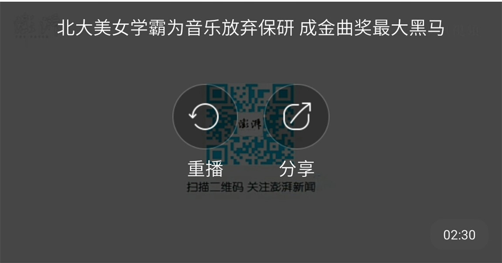

## TextureView+MediaPlayer实现在线短视频播放


## 列表item布局文件

```xml
<?xml version="1.0" encoding="utf-8"?>
<LinearLayout xmlns:android="http://schemas.android.com/apk/res/android"
              android:layout_width="match_parent"
              android:layout_height="wrap_content"
              android:orientation="vertical">

    <FrameLayout
        android:layout_width="match_parent"
        android:layout_height="wrap_content">


        <ImageView
            android:id="@+id/iv_bg"
            android:layout_width="match_parent"
            android:layout_height="200dp"
            android:scaleType="centerCrop"
            android:src="@mipmap/beautiful"
            android:visibility="visible"/>


        <com.jackchan.videoplayer.view.VideoPlayer
            android:id="@+id/videoPlayer"
            android:layout_width="match_parent"
            android:layout_height="200dp"
            android:visibility="visible"/>


    </FrameLayout>

    <LinearLayout
        android:layout_width="match_parent"
        android:layout_height="wrap_content"
        android:gravity="center_vertical"
        android:orientation="horizontal"
        android:padding="10dp">

        <ImageView
            android:id="@+id/iv_author"
            android:layout_width="20dp"
            android:layout_height="20dp"
            android:background="@drawable/qq_allshare_normal"/>

        <TextView
            android:id="@+id/tv_author_name"
            android:layout_width="wrap_content"
            android:layout_height="wrap_content"
            android:layout_marginLeft="10dp"
            android:text="飞行的钢蛋儿"
            android:textColor="#000"/>

        <TextView
            android:id="@+id/tv_play_count"
            android:layout_width="0dp"
            android:layout_height="wrap_content"
            android:layout_marginLeft="10dp"
            android:layout_weight="1"
            android:text="109万次播放"
            android:textColor="#8b8787"/>

        <ImageView
            android:id="@+id/iv_comment"
            android:layout_width="20dp"
            android:layout_height="20dp"
            android:layout_marginRight="2dp"
            android:background="@drawable/comment_video_normal"/>

        <TextView
            android:id="@+id/tv_comment_count"
            android:layout_width="wrap_content"
            android:layout_height="wrap_content"
            android:layout_marginRight="10dp"
            android:text="3940"
            android:textColor="#8b8787"/>

        <ImageView
            android:id="@+id/iv_comment_more"
            android:layout_width="20dp"
            android:layout_height="20dp"
            android:background="@drawable/more_pgc_comment_normal_night"/>
    </LinearLayout>

</LinearLayout>
```

其中VideoPlayer是自定义View，继承于RelativeLayout，是视频播放的关键类

## VideoPlayer

```java
    public VideoPlayer(Context context, AttributeSet attrs, int defStyleAttr) {
        super(context, attrs, defStyleAttr);
        initView();
    }
        //初始化布局
    private void initView() {
        View view = View.inflate(getContext(), R.layout.video_play, this);
        ButterKnife.bind(this,view);
		...
    }
```

```xml
<?xml version="1.0" encoding="utf-8"?>
<RelativeLayout
    xmlns:android="http://schemas.android.com/apk/res/android"
    android:layout_width="match_parent"
    android:layout_height="wrap_content">

    <!--视频播放界面-->
    <TextureView
        android:id="@+id/video_view"
        android:layout_width="match_parent"
        android:layout_height="200dp"
        android:visibility="visible"/>

    <!--视频播放控制界面-->
    <com.jackchan.videoplayer.view.VideoMediaController
        android:id="@+id/mediaController"
        android:layout_width="match_parent"
        android:layout_height="wrap_content"/>

</RelativeLayout>
```

实现视频播放功能的是TextureView，VideoMediaController视频播放控制器，自定义View，继承于RelativeLayout

### 视频播放（视频的初始化）

```java
    private void play(String url){
        try {
            mPlayer = MediaHelper.getInstance();
            mPlayer.reset();
            mPlayer.setDataSource(url);
            //让MediaPlayer和TextureView进行视频画面的结合
            mPlayer.setSurface(mSurface);
            //设置监听
            mPlayer.setOnBufferingUpdateListener(onBufferingUpdateListener);
            mPlayer.setOnCompletionListener(onCompletionListener);
            mPlayer.setOnErrorListener(onErrorListener);
            mPlayer.setOnPreparedListener(onPreparedListener);
            mPlayer.setScreenOnWhilePlaying(true);//在视频播放的时候保持屏幕的高亮
            //异步准备
            mPlayer.prepareAsync();
        } catch (Exception e) {
            e.printStackTrace();
        }
    }
```
### 准备完成监听

```java
    private MediaPlayer.OnPreparedListener onPreparedListener = new MediaPlayer.OnPreparedListener() {
        @Override
        public void onPrepared(MediaPlayer mp) {
            //隐藏视频加载进度条
            mediaController.setPbLoadingVisiable(View.GONE);
            //进行视频的播放
            MediaHelper.play();
            hasPlay = true;
            //隐藏标题
            mediaController.delayHideTitle();
            //设置视频的总时长
            mediaController.setDuration(mPlayer.getDuration());
            //更新播放的时间和进度
            mediaController.updatePlayTimeAndProgress();
        }
    };
```
### 进行TextureView控件创建的监听

```java
videoView.setSurfaceTextureListener(surfaceTextureListener);
```

```java
    private TextureView.SurfaceTextureListener surfaceTextureListener = new TextureView.SurfaceTextureListener() {

        //创建完成  TextureView才可以进行视频画面的显示
        @Override
        public void onSurfaceTextureAvailable(SurfaceTexture surface, int width, int height) {
           // Log.i(TAG,"onSurfaceTextureAvailable");
            mSurface = new Surface(surface);//连接对象（MediaPlayer和TextureView）
            play(info.url);
        }

        @Override
        public void onSurfaceTextureSizeChanged(SurfaceTexture surface, int width, int height) {
           // Log.i(TAG,"onSurfaceTextureSizeChanged");
        }

        @Override
        public boolean onSurfaceTextureDestroyed(SurfaceTexture surface) {
           // Log.i(TAG,"onSurfaceTextureDestroyed");
            return true;
        }

        @Override
        public void onSurfaceTextureUpdated(SurfaceTexture surface) {
           // Log.i(TAG,"onSurfaceTextureUpdated");
        }
    };
```

## VideoMediaController




布局文件如下

```xml
<?xml version="1.0" encoding="utf-8"?>
<FrameLayout
    xmlns:android="http://schemas.android.com/apk/res/android"
    android:layout_width="match_parent"
    android:layout_height="200dp"
    >

    <!--视频加载进度条-->
    <ProgressBar
        android:id="@+id/pb_loading"
        android:layout_width="wrap_content"
        android:layout_height="wrap_content"
        android:layout_gravity="center"
        android:visibility="gone"/>

    <RelativeLayout
        android:id="@+id/rl_play_finish"
        android:layout_width="match_parent"
        android:layout_height="match_parent"
        android:background="#b4000000"
        android:visibility="visible">

        <LinearLayout
            android:layout_width="wrap_content"
            android:layout_height="wrap_content"
            android:layout_centerInParent="true"
            android:orientation="horizontal">

            <LinearLayout
                android:layout_width="wrap_content"
                android:layout_height="wrap_content"
                android:layout_marginRight="20dp"
                android:orientation="vertical"
                >

                <ImageView
                    android:id="@+id/iv_replay"
                    android:layout_width="50dp"
                    android:layout_height="50dp"
                    android:src="@drawable/replay_video"/>

                <TextView
                    android:layout_width="wrap_content"
                    android:layout_height="wrap_content"
                    android:layout_gravity="center_horizontal"
                    android:layout_marginTop="5dp"
                    android:text="重播"
                    android:textColor="#fff"
                    android:textSize="14sp"/>
            </LinearLayout>

            <LinearLayout
                android:layout_width="wrap_content"
                android:layout_height="wrap_content"
                android:orientation="vertical"
                >

                <ImageView
                    android:id="@+id/iv_share"
                    android:layout_width="50dp"
                    android:layout_height="50dp"
                    android:src="@drawable/share_video"/>

                <TextView
                    android:layout_width="wrap_content"
                    android:layout_height="wrap_content"
                    android:layout_gravity="center_horizontal"
                    android:layout_marginTop="5dp"
                    android:text="分享"
                    android:textColor="#fff"
                    android:textSize="14sp"/>
            </LinearLayout>
        </LinearLayout>
    </RelativeLayout>

    <TextView
        android:id="@+id/tv_title"
        android:layout_width="match_parent"
        android:layout_height="wrap_content"
        android:layout_margin="10dp"
        android:gravity="center"
        android:text="@string/title"
        android:textColor="#fff"
        android:textSize="14sp"/>

    <ImageView
        android:id="@+id/iv_play"
        android:layout_width="50dp"
        android:layout_height="50dp"
        android:layout_gravity="center"
        android:src="@drawable/new_play_video"
        android:visibility="visible"/>

    <TextView
        android:id="@+id/tv_all_time"
        android:layout_width="wrap_content"
        android:layout_height="wrap_content"
        android:layout_gravity="bottom|right"
        android:layout_margin="10dp"
        android:background="@drawable/tv_time_bg"
        android:paddingBottom="5dp"
        android:paddingLeft="10dp"
        android:paddingRight="10dp"
        android:paddingTop="5dp"
        android:text="02:30"
        android:textColor="#fff"
        android:textSize="10sp"
        android:visibility="visible"/>

    <LinearLayout
        android:id="@+id/ll_play_control"
        android:layout_width="match_parent"
        android:layout_height="wrap_content"
        android:layout_gravity="bottom"
        android:background="#ca000000"
        android:gravity="center_vertical"
        android:padding="10dp"
        android:visibility="visible"
        >

        <TextView
            android:id="@+id/tv_use_time"
            android:layout_width="wrap_content"
            android:layout_height="wrap_content"
            android:layout_marginRight="10dp"
            android:text="00:00"
            android:textColor="#fff"
            android:textSize="10sp"/>

        <SeekBar
            android:id="@+id/seekBar"
            android:layout_width="0dp"
            android:layout_height="wrap_content"
            android:layout_marginRight="10dp"
            android:layout_weight="1"
            android:progressDrawable="@drawable/sb_progress_drawable"
            android:thumb="@drawable/biz_video_progress_thumb"
            />

        <TextView
            android:id="@+id/tv_time"
            android:layout_width="wrap_content"
            android:layout_height="wrap_content"
            android:layout_marginRight="10dp"
            android:text="02:30"
            android:textColor="#fff"
            android:textSize="10sp"/>

        <ImageView
            android:id="@+id/iv_fullscreen"
            android:layout_width="20dp"
            android:layout_height="20dp"
            android:src="@drawable/enlarge_fullscreen"/>
    </LinearLayout>
</FrameLayout>
```
显示或者隐藏视频控制界面
```java
    private void showOrHideVideoController() {
        if(llPlayControl.getVisibility() == View.GONE){
            //显示（标题、播放按钮、视频进度控制）
            tvTitle.setVisibility(View.VISIBLE);
            ivPlay.setVisibility(View.VISIBLE);
            //加载动画
            Animation animation = AnimationUtils.loadAnimation(getContext(),R.anim.bottom_enter);
            animation.setAnimationListener(new SimpleAnimationListener(){
                @Override
                public void onAnimationEnd(Animation animation) {
                    super.onAnimationEnd(animation);
                    llPlayControl.setVisibility(View.VISIBLE);
                    //过2秒后自动隐藏
                    mHandler.sendEmptyMessageDelayed(MSG_HIDE_CONTROLLER,2000);
                }
            });
            //执行动画
            llPlayControl.startAnimation(animation);
        }else{
            //隐藏（标题、播放按钮、视频进度控制）
            tvTitle.setVisibility(View.GONE);
            ivPlay.setVisibility(View.GONE);
            //加载动画
            Animation animation = AnimationUtils.loadAnimation(getContext(),R.anim.bottom_exit);
            animation.setAnimationListener(new SimpleAnimationListener(){
                @Override
                public void onAnimationEnd(Animation animation) {
                    super.onAnimationEnd(animation);
                    llPlayControl.setVisibility(View.GONE);
                }
            });
            //执行动画
            llPlayControl.startAnimation(animation);
        }
    }
```

更新播放的时间和进度

```java
    public void updatePlayTimeAndProgress() {
        //获取目前播放的进度
        int currentPosition = MediaHelper.getInstance().getCurrentPosition();
        //格式化
        String useTime = formatDuration(currentPosition);
        tvUseTime.setText(useTime);
        //更新进度
        int duration = MediaHelper.getInstance().getDuration();
        if(duration == 0){
            return;
        }
        int progress = 100*currentPosition/duration;
        seekBar.setProgress(progress);
        //发送一个更新的延时消息
        mHandler.sendEmptyMessageDelayed(MSG_UPDATE_TIME_PROGRESS,500);
    }
```
## 自定义SeekBar

```xml
<SeekBar
    android:id="@+id/seekBar"
    android:layout_width="0dp"
    android:layout_height="wrap_content"
    android:layout_marginRight="10dp"
    android:layout_weight="1"
    android:progressDrawable="@drawable/sb_progress_drawable"
    android:thumb="@drawable/biz_video_progress_thumb"
    />
```

sb_progress_drawable

```xml
<?xml version="1.0" encoding="utf-8"?>
<layer-list xmlns:android="http://schemas.android.com/apk/res/android">
    <item android:id="@android:id/background"
        android:drawable="@drawable/sb_bg"/>
    <item android:id="@android:id/secondaryProgress">
        <scale android:scaleWidth="100%">
            <selector>
                <item android:state_enabled="false">
                    <color android:color="@android:color/transparent"/>
                </item>
                <item android:drawable="@drawable/sb_second"/>
            </selector>
        </scale>
    </item>
    <item android:id="@android:id/progress">
        <scale android:scaleWidth="100%">
            <selector>
                <item android:state_enabled="false">
                    <color android:color="@android:color/transparent"/>
                </item>
                <item android:drawable="@drawable/sb_progress"/>
            </selector>
        </scale>
    </item>
</layer-list>
```
## 列表的item滚动出屏幕时停止播放

```java
private RecyclerView.OnScrollListener onScrollListener = new RecyclerView.OnScrollListener() {
        @Override
        public void onScrollStateChanged(RecyclerView recyclerView, int newState) {
            super.onScrollStateChanged(recyclerView, newState);
        }

        //进行滑动
        @Override
        public void onScrolled(RecyclerView recyclerView, int dx, int dy) {
            super.onScrolled(recyclerView, dx, dy);
            //获取屏幕上显示的第一个条目和最后一个条目的下标
            int firstVisibleItemPosition = lm.findFirstVisibleItemPosition();
            int lastVisibleItemPosition = lm.findLastVisibleItemPosition();
            //获取播放条目的下标
            int currentPosition = adapter.currentPosition;
            if((firstVisibleItemPosition > currentPosition || lastVisibleItemPosition < currentPosition) && currentPosition > -1){
                //让播放隐藏的条目停止
                MediaHelper.release();
                adapter.currentPosition = -1;
                adapter.notifyDataSetChanged();
            }
        }
    };
```